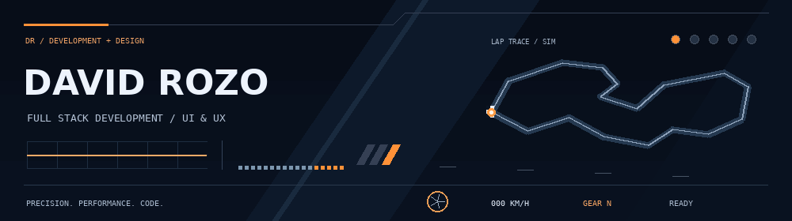
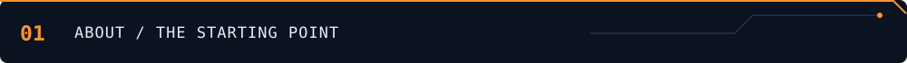
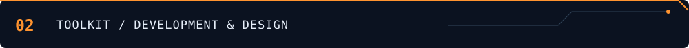

<p align="center">
  
</p>

<h2 align="center">Hi , I'm David Rozo</h2>
<p align="center"><strong>Full Stack Development · UI/UX · Web Applications</strong></p>
<p align="center">I enjoy turning ideas into web experiences that look thoughtful and feel intuitive.<br />Learning through code, experimenting with design, and always asking what comes next.</p>

<p align="center">
  <a href="#about-me">About</a> ·
  <a href="#technology-toolkit">Toolkit</a> ·
  <a href="mailto:davidrozotuberquia@gmail.com">Contact</a>
</p>



## About me

I'm a developer interested in the connection between how applications work and how people experience them. I like exploring both sides: building the logic behind a product and shaping the interface in front of it.

- Currently working on software development projects and programming courses.
- Developing my skills in React, TypeScript, Node.js, Express, and PostgreSQL.
- Exploring interface design with Figma and visual ideas with Canva.
- Happy to talk about Python, Java, C++, and web development.

> **My approach:** stay curious, build something, learn from it, and improve.



## Technology toolkit

### 01 / Frontend


**React · TypeScript · JavaScript · HTML · CSS · Tailwind CSS**

### 02 / Backend & data


**Node.js · Express · PostgreSQL**

### 03 / Languages


**Python · Java · C++**

### 04 / Design

<p>
  
  
</p>

**Figma · Canva**

<details>
<summary><strong>My go-to stack</strong></summary>

```text
INTERFACE   React + TypeScript + Tailwind CSS
API         Node.js + Express
DATABASE    PostgreSQL
DESIGN      Figma + Canva
```

</details>


## Let's connect

Have an idea, a project, or something interesting to share?

<p>
  <a href="mailto:davidrozotuberquia@gmail.com"></a>
</p>

**davidrozotuberquia@gmail.com**

<!-- SOCIAL LINKS: replace the placeholders with your real URLs, then remove this comment wrapper.
<p>
  <a href="YOUR_LINKEDIN_URL"></a>
  <a href="YOUR_PORTFOLIO_URL"></a>
  <a href="YOUR_INSTAGRAM_URL"></a>
  <a href="YOUR_LINKTREE_URL"></a>
</p>
-->

---

<p align="center"><em>A little curiosity. A lot of possibilities.</em></p>
